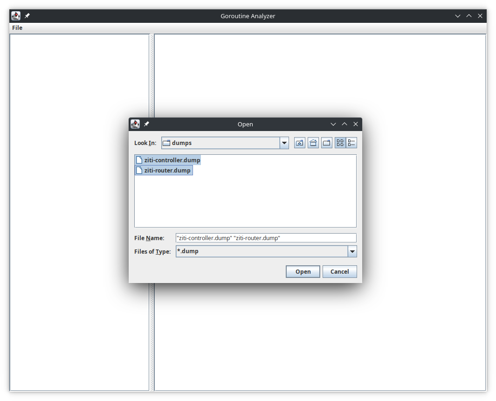
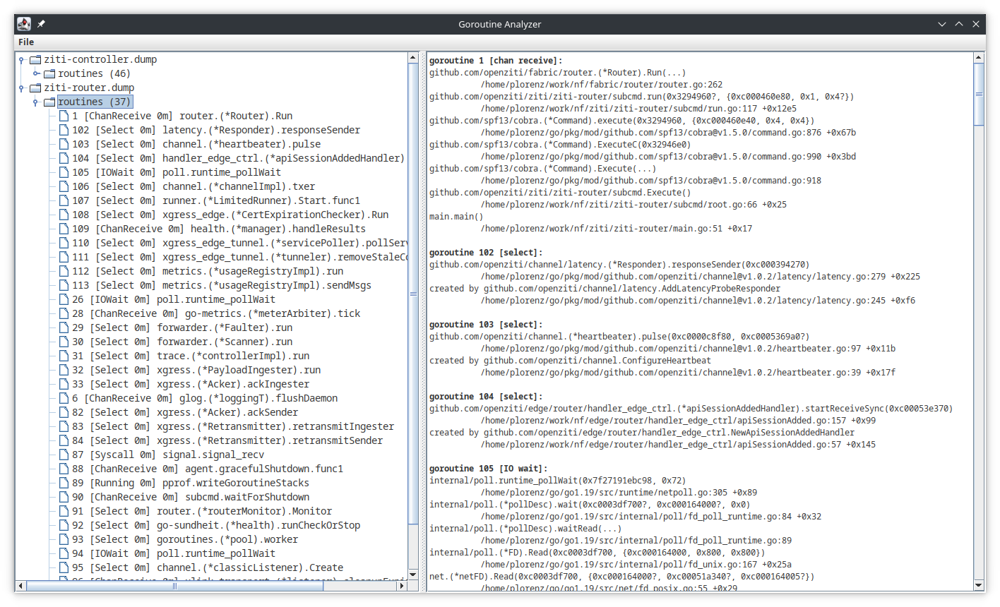
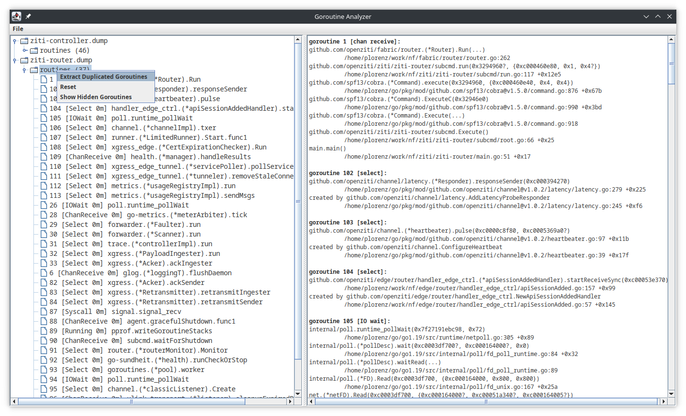
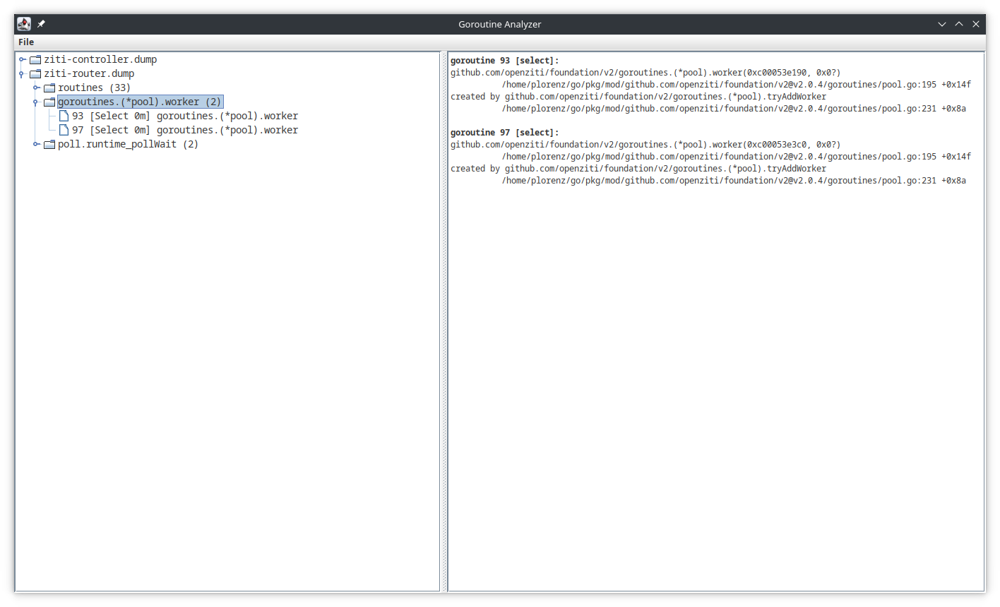
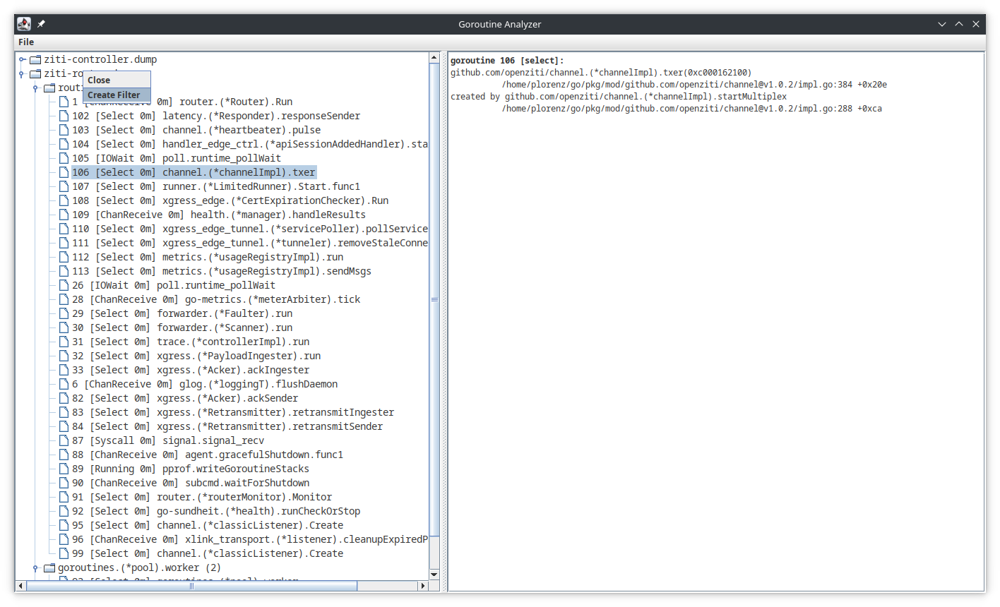
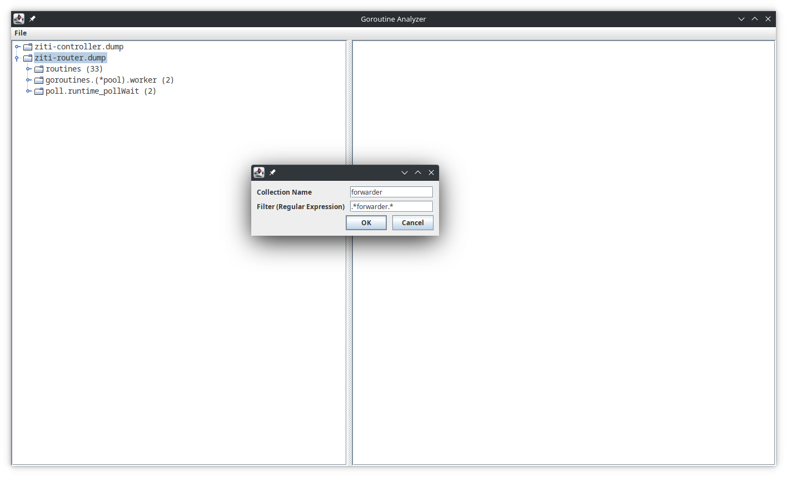
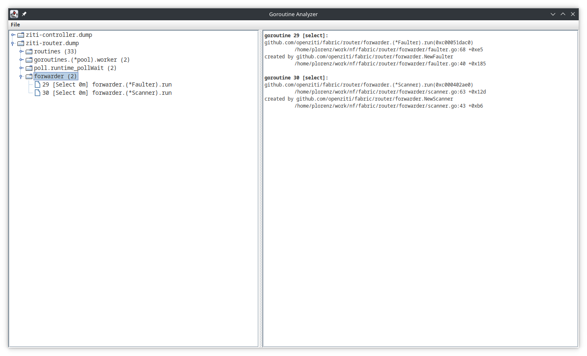
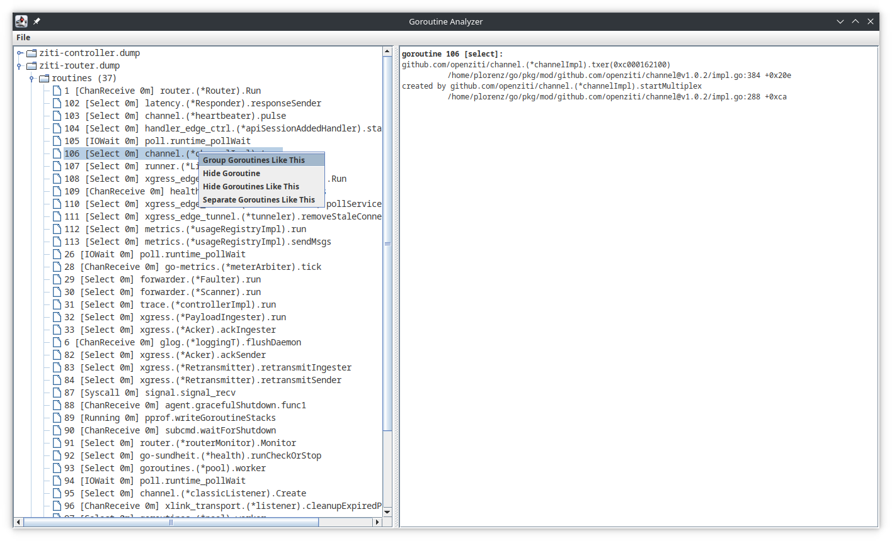

# goroutine-analyzer

## Overview
This is a GUI tool for helping analyze golang goroutine dumps. It has the following features:

* Working with multiple dumps
* Grouping, extracting or hiding similar goroutines, either manually or automatically
* Regex based grouping

The tool was written to support production deployments of [OpenZiti](https://github.com/openziti/ziti).
It works well together with the [agent library](https://github.com/openziti/agent) which supports
debugging operations such as extracting stackdumps and getting pprof dumps.  

The tool is written in Java for expediency on the UI front. 

## Installation
Installers can be downloaded for the latest release at https://github.com/openziti/goroutine-analyzer/releases/latest

The following are available:

* Windows x64
* MacOS x64
  * MacOS M1 support will be provided once GitHub actions provides M1 runners. In the meantime, you can use an 
    application bundle or just clone and run.
* Linux .deb 
  * rpm builds are currently unavailable as GitHub actions only provides ubuntu runners. If anyone is interested
    an appimage build would probably be straightforward to add.
* Application bundles with start scripts if Java is pre-installed on your system

The application can also be run from source by cloning the repository and running `./gradlew run`. I run with 
Java 17, but it will likely work with older versions as well. 

## How to use
### Opening Stack Dumps
Stack dumps can be opened from the file system. Multiple can be selected, and more can be added to the open set at any 
time.

Once opened, the stack dumps will be shown unfiltered. Here the set of routines has been expanded. Whatever
goroutine group or individual goroutine has been selected will be shown in the window on the right.

### Auto-Sorting Goroutines
Usually the first thing I'll do when looking at a stack dump is to group all the similar gorotines together. This 
can be done as follows:

When the operation is complete, you'll see anything which is duplicated pulled out into its own group. Any unique
goroutines will be left in the initial routines view. 

In order to group goroutines, they are compared ignoring any object pointers. As long as the methods and line numbers
match up, they will be considered equivalent.

### Filtering
Sometimes you want to find all goroutines related to a given package, method or pointer. You can do this with a filter.

A filter is specified using a regular expression and will be matched against the full text of each goroutine.

Any goroutines matching the regular expression will be placed into their own group.

After the filter is created, it can be edited or deleted.

### Other Operations
In addition, if you're trying to narrow things down iteratively, you can select individual goroutines and perform
the following operations.

* `Group Goroutines Like This` - find other goroutines like this and put them in a group, leaving them in the routines group
* `Hide Goroutine` - hide this goroutine from view. Display of hidden goroutines can be toggle on and off at the group level
* `Unide Goroutine` - show this goroutine again. Only displays for hidden goroutines
* `Hide Goroutines Like This` - hides all goroutines matching this one
* `Separate Goroutines Like This` - acts like the group option except that the goroutines are also removed from the current group.

## Thank you
This tool was inspired by the following:

* [TDA (thread dump analyzer)](https://github.com/mkbrv/tda) - Original version at https://java.net/projects/tda doesn't seem to be available anymore
* [goroutine-inspect](https://github.com/linuxerwang/goroutine-inspect)

The build was helped along by [this very helpful example repo from GitHub user sualeh](https://github.com/sualeh/build-jpackage)
